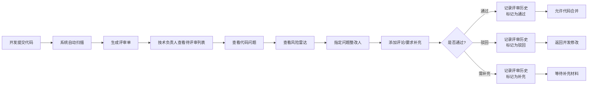
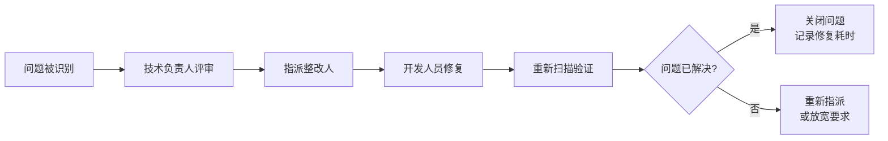

## 1. 产品概述

代码质量评审 Web 应用是为技术负责人打造的代码合并前质量检查工具，通过系统化的评审流程和风险可视化，确保代码变更符合团队规范、降低技术债务。

- **核心价值**：在代码合并前识别质量问题、高风险文件和复杂度飙升，建立团队可量化的代码质量标准
- **目标用户**：技术负责人、架构师、高级开发工程师
- **解决问题**：人工评审遗漏、评审标准不统一、风险不可见、评审历史无沉淀

## 2. 核心功能

### 2.1 用户角色
| 角色 | 登录方式 | 核心权限 |
|------|----------|----------|
| 技术负责人 | 企业账号/SSO | 创建评审单、设置检查项、审批通过/驳回、维护团队规则、查看所有统计 |
| 开发工程师 | 企业账号/SSO | 查看分配给自己的问题、修复问题、添加评论、查看个人修复统计 |
| 管理员 | 企业账号/SSO | 系统配置、用户管理、规则模板维护 |

### 2.2 功能模块
1. **待评审列表**：评审单列表、仓库/分支筛选、新增问题标识、评审状态管理
2. **代码问题页**：问题详情展示、文件高亮、评论功能、整改人指定、问题状态流转
3. **风险雷达**：高风险文件识别、函数复杂度变化趋势、多维度风险图表
4. **团队规则**：编码规范维护、必须通过检查项配置、常见问题模板管理
5. **评审记录**：评审历史、耗时统计、个人修复情况、评审结果追踪

### 2.3 页面详情
| 页面名称 | 模块名称 | 功能描述 |
|----------|----------|----------|
| 待评审列表 | 筛选区域 | 按仓库、分支、创建时间、状态筛选评审单 |
| 待评审列表 | 评审单卡片 | 展示仓库、分支、提交人、新增问题数、高风险文件数、创建时间 |
| 待评审列表 | 操作区 | 进入评审、快速查看、一键驳回 |
| 代码问题页 | 问题列表 | 按严重等级分类展示问题：阻断、严重、警告、建议 |
| 代码问题页 | 代码预览 | 高亮显示问题代码行、上下文代码展示 |
| 代码问题页 | 评论系统 | 对问题添加评论、@提及相关人员 |
| 代码问题页 | 整改指派 | 指定整改人、设置截止时间 |
| 风险雷达 | 风险概览 | 总体风险评分、高风险文件TOP10、复杂度趋势图 |
| 风险雷达 | 雷达图 | 多维度风险展示：复杂度、重复率、覆盖率、安全漏洞、规范违反 |
| 风险雷达 | 文件列表 | 高风险文件详情、风险原因、建议修复方案 |
| 团队规则 | 规范列表 | 编码规范条目、启用/禁用、优先级设置 |
| 团队规则 | 检查项配置 | 设置必须通过的检查项、可配置阈值 |
| 团队规则 | 问题模板 | 常见问题模板管理、一键应用到评论 |
| 评审记录 | 历史列表 | 所有评审历史、筛选、搜索 |
| 评审记录 | 统计面板 | 评审耗时统计、个人修复率排名、问题类型分布 |
| 评审记录 | 详情面板 | 评审过程回溯、通过/驳回理由、补充说明 |

## 3. 核心流程

### 主评审流程

### 问题处理流程

## 4. 用户界面设计

### 4.1 设计风格
- **主色调**：深邃科技蓝 (#1e3a5f)，代表专业、严谨、信任
- **辅助色**：警示红 (#e53935)、严重橙 (#fb8c00)、警告黄 (#fdd835)、成功绿 (#43a047)
- **背景风格**：深色模式为主，渐变深蓝背景配细微网格纹理
- **字体**：标题使用 Space Grotesk，正文使用 JetBrains Mono（代码字体）
- **布局**：左侧导航栏 + 顶部状态栏 + 主内容区的经典开发工具布局
- **动效**：卡片悬浮微动画、数据加载骨架屏、图表渐入动画

### 4.2 页面设计概览
| 页面名称 | 模块名称 | UI 元素 |
|----------|----------|----------|
| 待评审列表 | 顶部筛选 | 下拉选择器、搜索框、状态标签、时间范围选择器 |
| 待评审列表 | 列表区域 | 卡片式布局、状态角标、数据徽章、进度条 |
| 代码问题页 | 问题分类 | Tab 切换、严重等级颜色编码、计数徽章 |
| 代码问题页 | 代码区域 | 等宽字体、行号、高亮背景、差异对比 |
| 风险雷达 | 图表区 | 雷达图、趋势折线图、热力图、数据卡片 |
| 团队规则 | 规则列表 | 可折叠分组、开关控件、拖拽排序 |
| 评审记录 | 统计区 | 指标卡片、柱状图、饼图、排名列表 |

### 4.3 响应式设计
- 桌面端（≥1280px）：完整三栏布局，侧边导航 + 主内容 + 详情面板
- 平板端（≥768px）：折叠式侧边导航，主内容区域自适应
- 移动端（<768px）：底部 Tab 导航，卡片垂直堆叠，图表简化展示

### 4.4 交互细节
- 问题卡片悬停时显示操作按钮（查看、指派、忽略）
- 代码行点击可添加行内评论
- 雷达图各扇区支持点击钻取详情
- 规则支持拖拽调整优先级
- 评论支持 @ 提及、Markdown 格式
- 所有操作均有实时反馈（Toast 提示、状态变更动画）
