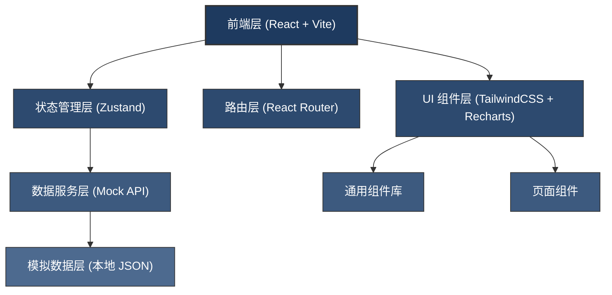
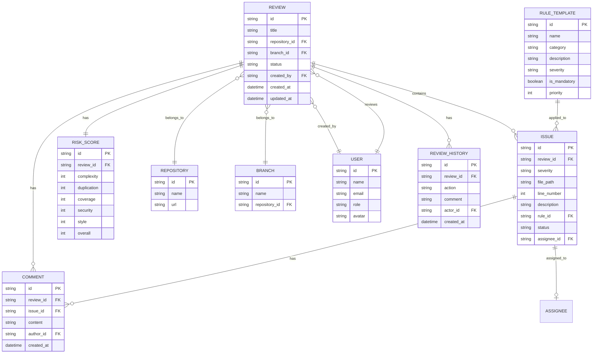

## 1. 架构设计



## 2. 技术栈说明

- **前端框架**: React@18 + TypeScript
- **构建工具**: Vite@5
- **样式方案**: TailwindCSS@3
- **状态管理**: Zustand@4（轻量级，简单易用）
- **路由管理**: React Router Dom@6
- **图表库**: Recharts@2（React 生态图表，支持雷达图、折线图、柱状图等）
- **图标库**: Lucide React（现代简洁的 SVG 图标）
- **代码高亮**: Prism.js（代码语法高亮展示）
- **数据模拟**: MSW + 本地 JSON 数据（无后端依赖，前端自包含）

## 3. 路由定义

| 路由路径 | 页面名称 | 说明 |
|----------|----------|------|
| `/` | 重定向到待评审列表 | 入口路由 |
| `/reviews` | 待评审列表 | 展示所有待评审的合并请求 |
| `/reviews/:id` | 评审详情-代码问题页 | 单个评审单的代码问题详情 |
| `/reviews/:id/risk` | 评审详情-风险雷达 | 单个评审单的风险分析 |
| `/radar` | 风险雷达总览 | 全局风险分析仪表盘 |
| `/rules` | 团队规则 | 编码规范和检查项配置 |
| `/records` | 评审记录 | 历史评审记录和统计 |

## 4. 核心数据模型

### 4.1 数据模型 ER 图


### 4.2 类型定义

```typescript
// 评审单状态
type ReviewStatus = 'pending' | 'approved' | 'rejected' | 'needs_info';

// 问题严重程度
type Severity = 'blocker' | 'critical' | 'warning' | 'info';

// 问题状态
type IssueStatus = 'open' | 'fixed' | 'ignored';

interface Repository {
  id: string;
  name: string;
  url: string;
}

interface Branch {
  id: string;
  name: string;
  repositoryId: string;
}

interface User {
  id: string;
  name: string;
  email: string;
  role: 'tech_lead' | 'developer' | 'admin';
  avatar: string;
}

interface Issue {
  id: string;
  reviewId: string;
  severity: Severity;
  filePath: string;
  lineNumber: number;
  endLineNumber?: number;
  codeSnippet: string;
  description: string;
  ruleId: string;
  status: IssueStatus;
  assigneeId?: string;
  createdAt: string;
  comments: Comment[];
}

interface Comment {
  id: string;
  reviewId: string;
  issueId?: string;
  content: string;
  authorId: string;
  createdAt: string;
  mentions: string[];
}

interface RiskScore {
  id: string;
  reviewId: string;
  complexity: number;
  duplication: number;
  coverage: number;
  security: number;
  style: number;
  overall: number;
}

interface HighRiskFile {
  filePath: string;
  riskScore: number;
  reasons: string[];
  complexityChange: number;
  suggestion: string;
}

interface FunctionComplexity {
  name: string;
  filePath: string;
  oldComplexity: number;
  newComplexity: number;
  change: number;
}

interface RuleTemplate {
  id: string;
  name: string;
  category: string;
  description: string;
  severity: Severity;
  isMandatory: boolean;
  priority: number;
  isEnabled: boolean;
  examples?: { good: string; bad: string };
}

interface ReviewHistory {
  id: string;
  reviewId: string;
  action: 'approved' | 'rejected' | 'needs_info' | 'comment_added' | 'issue_assigned';
  comment: string;
  actorId: string;
  createdAt: string;
}

interface Review {
  id: string;
  title: string;
  description: string;
  repositoryId: string;
  branchId: string;
  targetBranch: string;
  commitHash: string;
  status: ReviewStatus;
  createdBy: string;
  createdAt: string;
  updatedAt: string;
  issues: Issue[];
  riskScore: RiskScore;
  highRiskFiles: HighRiskFile[];
  functionComplexities: FunctionComplexity[];
  history: ReviewHistory[];
  reviewDuration?: number;
}

interface UserStats {
  userId: string;
  totalIssuesFixed: number;
  avgFixTime: number;
  fixRate: number;
  issuesBySeverity: Record<Severity, number>;
}
```

## 5. 项目目录结构

```
c:\TraeProjects\1191\
├── .trae\documents\
│   ├── PRD-代码质量评审应用.md
│   └── TECH-代码质量评审应用.md
├── public\
├── src\
│   ├── assets\              # 静态资源
│   ├── components\          # 通用组件
│   │   ├── Layout\          # 布局组件
│   │   │   ├── Sidebar.tsx
│   │   │   ├── Header.tsx
│   │   │   └── index.tsx
│   │   ├── ui\              # 基础 UI 组件
│   │   │   ├── Button.tsx
│   │   │   ├── Card.tsx
│   │   │   ├── Badge.tsx
│   │   │   ├── Tag.tsx
│   │   │   ├── Modal.tsx
│   │   │   ├── Select.tsx
│   │   │   ├── Input.tsx
│   │   │   └── CodeBlock.tsx
│   │   ├── charts\          # 图表组件
│   │   │   ├── RadarChart.tsx
│   │   │   ├── LineChart.tsx
│   │   │   ├── BarChart.tsx
│   │   │   └── PieChart.tsx
│   │   └── ReviewCard.tsx   # 评审卡片
│   ├── pages\               # 页面组件
│   │   ├── reviews\         # 待评审列表
│   │   │   ├── index.tsx
│   │   │   ├── ReviewList.tsx
│   │   │   └── FilterBar.tsx
│   │   ├── review-detail\   # 评审详情
│   │   │   ├── index.tsx
│   │   │   ├── IssuesTab.tsx
│   │   │   ├── RiskTab.tsx
│   │   │   ├── IssueDetail.tsx
│   │   │   ├── CommentSection.tsx
│   │   │   └── AssignDialog.tsx
│   │   ├── radar\           # 风险雷达
│   │   │   ├── index.tsx
│   │   │   ├── RiskOverview.tsx
│   │   │   ├── HighRiskFiles.tsx
│   │   │   └── ComplexityTrend.tsx
│   │   ├── rules\           # 团队规则
│   │   │   ├── index.tsx
│   │   │   ├── RuleList.tsx
│   │   │   ├── MandatoryChecks.tsx
│   │   │   └── TemplateManager.tsx
│   │   └── records\         # 评审记录
│   │       ├── index.tsx
│   │       ├── HistoryList.tsx
│   │       ├── StatisticsPanel.tsx
│   │       └── UserStatsTable.tsx
│   ├── store\               # 状态管理
│   │   ├── useReviewStore.ts
│   │   ├── useRuleStore.ts
│   │   └── useUserStore.ts
│   ├── data\                # Mock 数据
│   │   ├── reviews.ts
│   │   ├── rules.ts
│   │   └── users.ts
│   ├── types\               # TypeScript 类型
│   │   └── index.ts
│   ├── utils\               # 工具函数
│   │   ├── formatters.ts
│   │   ├── severity.ts
│   │   └── colors.ts
│   ├── App.tsx
│   ├── main.tsx
│   ├── index.css
│   └── vite-env.d.ts
├── index.html
├── package.json
├── tsconfig.json
├── tsconfig.node.json
├── vite.config.ts
├── tailwind.config.js
└── postcss.config.js
```

## 6. 状态管理设计

### useReviewStore
- `reviews: Review[]` - 评审单列表
- `currentReview: Review | null` - 当前查看的评审单
- `filters: { repositoryId?, branchId?, status?, dateRange? }` - 筛选条件
- `actions`: 
  - `fetchReviews()` - 获取评审单列表
  - `fetchReview(id)` - 获取单个评审单详情
  - `updateFilter(key, value)` - 更新筛选条件
  - `addComment(reviewId, issueId?, content)` - 添加评论
  - `assignIssue(reviewId, issueId, assigneeId)` - 指派问题
  - `approveReview(reviewId, comment)` - 通过评审
  - `rejectReview(reviewId, comment)` - 驳回评审
  - `requestInfo(reviewId, comment)` - 要求补充信息

### useRuleStore
- `rules: RuleTemplate[]` - 规则模板列表
- `mandatoryChecks: string[]` - 必须通过的检查项 ID
- `actions`:
  - `toggleRule(id)` - 启用/禁用规则
  - `updateRulePriority(id, priority)` - 更新规则优先级
  - `addRule(rule)` - 新增规则
  - `updateMandatoryChecks(ids)` - 更新必须检查项

### useUserStore
- `users: User[]` - 用户列表
- `currentUser: User` - 当前登录用户
- `userStats: UserStats[]` - 用户统计数据
